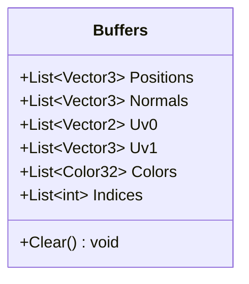

# Buffers

**Módulo:** [[Modulo Editor|Editor]] · **Namespace:** `AlienFarms.Editor` · **Archivo:** `Assets/Scripts/Editor/GrassMeshBuilder.cs`

## Diagrama

```mermaid
classDiagram
  direction LR
  class Buffers {
    +List~Vector3~ Positions
    +List~Vector3~ Normals
    +List~Vector2~ Uv0
    +List~Vector3~ Uv1
    +List~Color32~ Colors
    +List~int~ Indices
    +Clear() void
  }
  classDef external fill:#eee,stroke:#999,stroke-dasharray: 4 3,color:#555
```

## Usa
[[GrassBakeSettings]]
