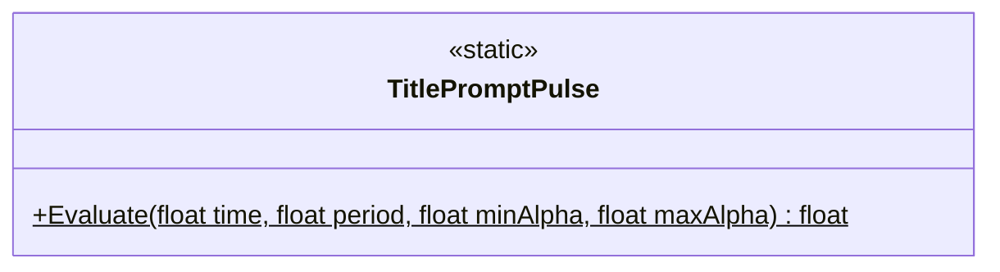

# TitlePromptPulse

**Módulo:** [[Modulo Menu|Menu]] · **Namespace:** `AlienFarms.Menu` · **Archivo:** `Assets/Scripts/Menu/TitlePromptPulse.cs`

## Diagrama

```mermaid
classDiagram
  direction LR
  class TitlePromptPulse {
    <<static>>
    +Evaluate(float time, float period, float minAlpha, float maxAlpha)$ float
  }
  classDef external fill:#eee,stroke:#999,stroke-dasharray: 4 3,color:#555
```

## Usado por
[[TitleIntroDirector]]
